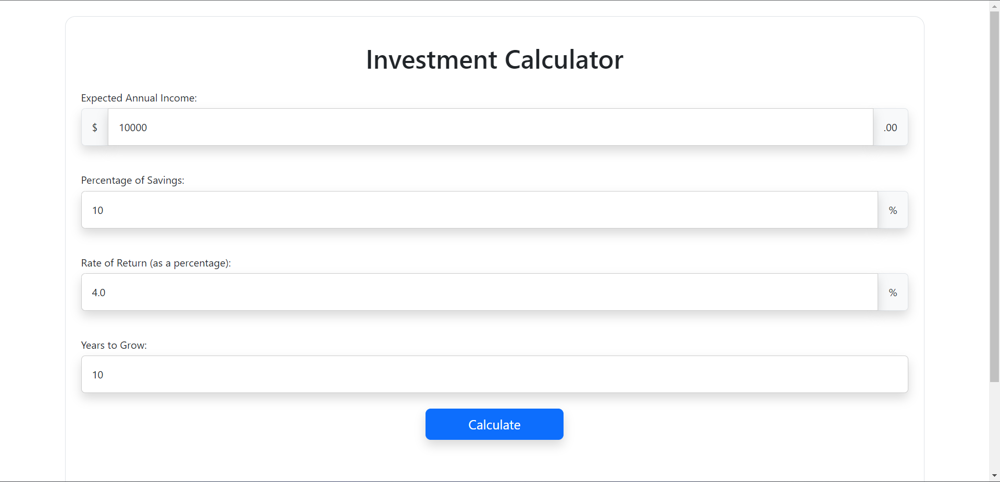
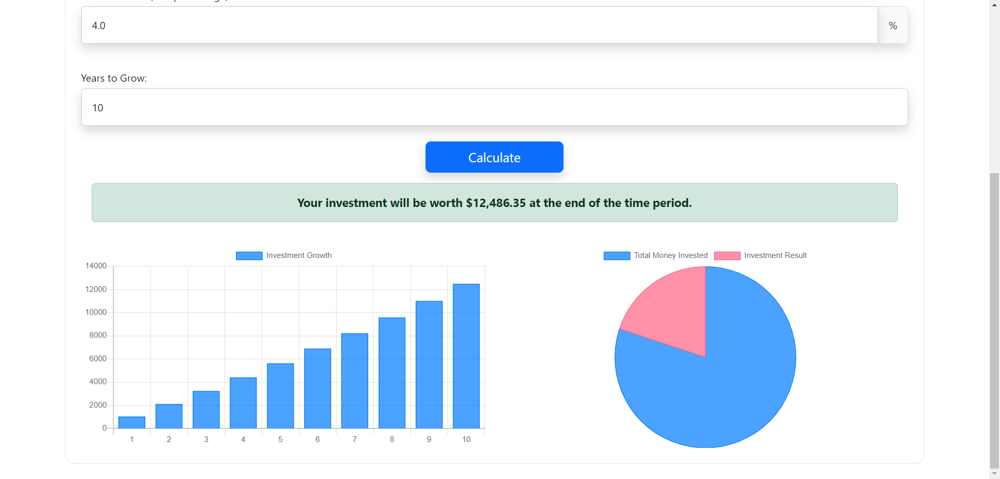

<a name="readme-top"></a>

<!-- PROJECT LOGO -->
<br />
<div align="center">
  <a href="https://www.linkedin.com/in/juan-carlier-955539259/">
    
  </a>
  <br>
  <a href="https://github.com/github_username/repo_name">
    
  </a>

<h2 align="center">Investment Calculator</h3>

  <p align="center">
    Project Description
    <br />
    <a href="https://github.com/JuanEstebanCarlier/investment-calculator"><strong>Explore the docs »</strong></a>
    <br />
    <br />
    <a href="https://www.youtube.com/channel/UCiAvkixUEqjnc_1dJ_f282A">View Demo</a>

  </p>
</div>


<!-- TABLE OF CONTENTS -->
<details>
  <summary>Table of Contents</summary>
  <ol>
    <li>
      <a href="#about-the-project">About The Project</a>
      <ul>
        <li><a href="#built-with">Built With</a></li>
      </ul>
    </li>
    <li>
      <a href="#getting-started">Getting Started</a>
      <ul>
        <li><a href="#prerequisites">Prerequisites</a></li>
      </ul>
    </li>
    <li><a href="#usage">Usage</a></li>
    <li><a href="#roadmap">Roadmap</a></li>
    <li><a href="#contact">Contact</a></li>
    <li><a href="#acknowledgments">Acknowledgments</a></li>
  </ol>
</details>


<!-- ABOUT THE PROJECT -->
## About The Project


This is a web based tool capable of calculating the Investment Growth and Final Value for a Yearly Investment and a Return Rate. The growth is also visually represented in two charts.

<p align="right">(<a href="#readme-top">back to top</a>)</p>


### Built With

* [![HTML][HTML.com]][HTML-url]
* [![CSS][CSS.com]][CSS-url]
* [![JavaScript][JavaScript.com]][JavaScript-url]
* [![Chart.js][Chart.js.com]][Chart.js-url]
* [![Bootstrap][Bootstrap.com]][Bootstrap-url]

<p align="right">(<a href="#readme-top">back to top</a>)</p>


<!-- GETTING STARTED -->
## Getting Started


To get a local copy up and running follow these simple example steps. Download index.html, styles.css, and script.js to run this web based tool locally in your codespace. I am using the CS50's
```
http-server
```
command to create a local http server with CS50's github codespace.

### Prerequisites

This software doesn't need any prerequisites or installation to be able to run.

<p align="right">(<a href="#readme-top">back to top</a>)</p>


<!-- USAGE EXAMPLES -->
## Usage

The index html page contains a form asking the user 4 inputs:

1. Expected Annual Income
2. Percentage of Savings
3. Rate of Return as a percentage
4. Years to Grow

Every variable requested is needed to perform the calculation. However, the form has predetermined values which are typical for each variable so that it is easier to use.

Default Values:

1. Expected Annual Income ($10,000)
2. Percentage of Savings (10%)
3. Rate of Return as a percentage (4%)
4. Years to Grow (10 years)

The default values will output the following when pressing the Calculate Button:



Output:
- Investment is worth $12,486.35 after 10 years.
- Left Chart: Shows the growth of the recurring investment every single year
- Right Chart: Shows the proportion of the money invested and the Investment Earnings

For a correct and reasonable result I added the following restrictions to the form inputs.

Minimum and Step Values:

1. Expected Annual Income ($1), ($1)
2. Percentage of Savings (0.1%), (0.01%)
3. Rate of Return as a percentage (0.1%), (0.01%)
4. Years to Grow (1 year), (1 year)

_For more examples, please refer to the [Documentation](https://example.com)_

<p align="right">(<a href="#readme-top">back to top</a>)</p>


<!-- ROADMAP -->
## Roadmap

- [x] Basic Investment Calculator outputs the final worth.
- [x] Add visual representation of the investment's growth over the years.
- [ ] Add a recurring period of time selection (biweekly, monthly, yearly).


<p align="right">(<a href="#readme-top">back to top</a>)</p>

<!-- CONTACT -->
## Contact

- Github: JuanEstebanCarlier
- LinkedIn: Juan Carlier
- Email: carlier1@msu.edu
- Title: Investment Calculator

Project Link: [Investment Calculator](https://github.com/JuanEstebanCarlier/investment-calculator)

<p align="right">(<a href="#readme-top">back to top</a>)</p>


<!-- ACKNOWLEDGMENTS -->
## Acknowledgments

* [CS50 Final Project](https://cs50.harvard.edu/x/2023/project/)
* [Bootstrap 5 Documentation](https://getbootstrap.com)
* [JavaScript W3Schools Tutorials](https://www.w3schools.com/js/)
* [Chart.js Documentation](https://www.chartjs.org/)

<p align="right">(<a href="#readme-top">back to top</a>)</p>


<!-- MARKDOWN LINKS & IMAGES -->
<!-- https://www.markdownguide.org/basic-syntax/#reference-style-links -->
[Bootstrap.com]: https://img.shields.io/badge/Bootstrap-563D7C?style=for-the-badge&logo=bootstrap&logoColor=white
[Bootstrap-url]: https://getbootstrap.com


[HTML.com]: https://img.shields.io/badge/html5-%23E34F26.svg?style=for-the-badge&logo=html5&logoColor=white
[HTML-url]: https://www.w3schools.com/html/

[JavaScript.com]: https://img.shields.io/badge/javascript-%23323330.svg?style=for-the-badge&logo=javascript&logoColor=%23F7DF1E
[JavaScript-url]: https://www.w3schools.com/js/

[CSS.com]: https://img.shields.io/badge/css3-%231572B6.svg?style=for-the-badge&logo=css3&logoColor=white
[CSS-url]: https://www.w3schools.com/css/

[Chart.js.com]: https://img.shields.io/badge/chart.js-F5788D.svg?style=for-the-badge&logo=chart.js&logoColor=white
[Chart.js-url]: https://www.chartjs.org/

